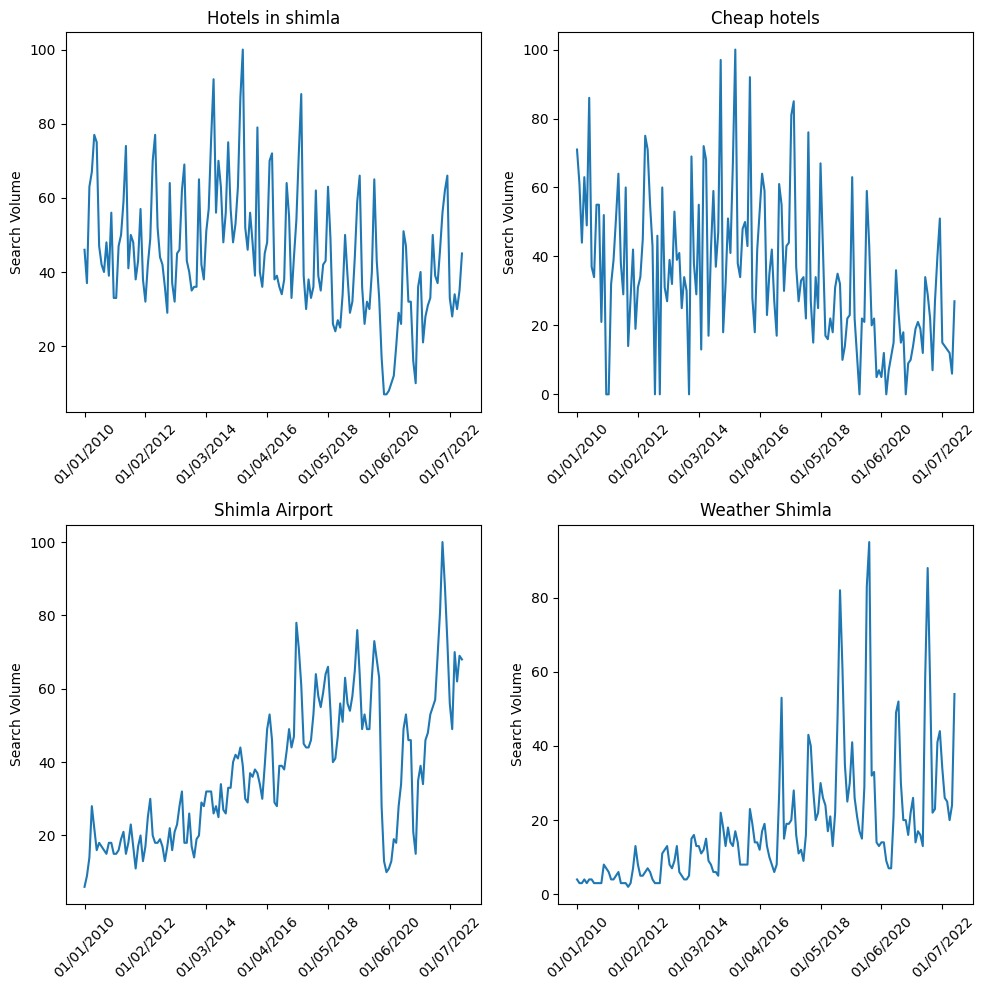
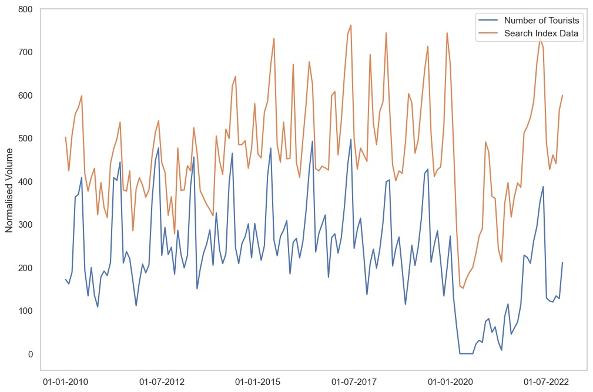
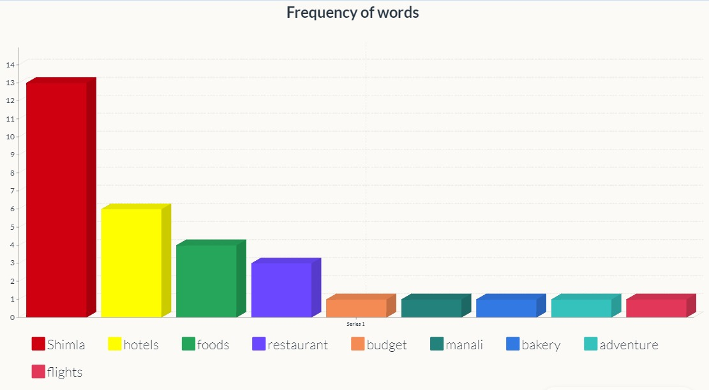
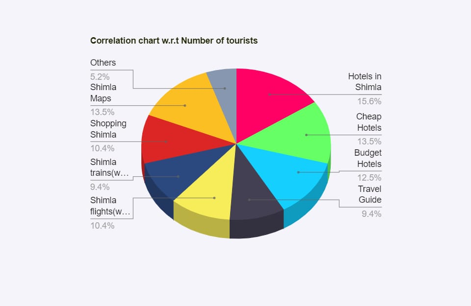
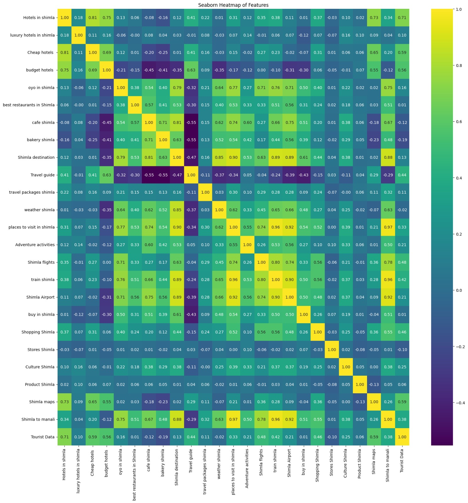

# 🌟 **Tourism Footfall Prediction using Internet Data**🌟

Welcome to the **Tourism Prediction Repository**! This repository leverages advanced time series forecasting and machine learning techniques to predict the number of tourists visiting Shimla, India, based on historical tourist data and internet search trends.

---

## **Overview**
This project is part of the Open IIT Data Analytics initiative, focusing on enhancing the accuracy of tourism demand forecasting by integrating search trend data with traditional visitor statistics. By using diverse forecasting models and advanced feature engineering, this project aims to assist in resource allocation and strategic decision-making for the tourism sector.

---

## **Datasets**
- **Tourist Data**: Monthly data of tourist arrivals in Shimla (2010-2022), sourced from Himachal Pradesh tourism records.
- **Search Index Data**: Trends for relevant queries from Google Trends, including terms related to lodging, dining, recreation, and shopping.

## 🎯 **Project Objectives**
- Integrate search trend data with historical tourist volumes to improve prediction accuracy.
- Use advanced time series and machine learning techniques to forecast tourist arrivals.
- Identify the most influential features using PCA and Granger causality tests.

---

## 🚀 **Modeling Approach**

**1. Data Preprocessing**
- Removed irrelevant features using **Principal Component Analysis (PCA)**.
- Introduced lagged variables based on **Granger causality tests** to capture temporal dependencies.

**2. Time Series Models**
- **SARIMA**: Seasonal ARIMA for capturing seasonality and trends.
- **SARIMAX**: Extends SARIMA with external variables like search trends.

**3. Deep Learning Models**
- **LSTM**: Long Short-Term Memory for handling sequential dependencies.
- **ANN**: Artificial Neural Network for multi-input forecasting.

**4. Gradient Boosting**
- **CatBoost**: Optimized gradient boosting for tabular data.

**5. Evaluation Metrics**
- **Root Mean Squared Error (RMSE)** and **Mean Absolute Error (MAE)** to assess model performance.

---

## 📊 **Performance Metrics**

| Model               | RMSE  | MAE   |
|---------------------|-------|-------|
| **SARIMA**         | 3.34  | 2.77  |
| **SARIMAX**        | 3.78  | 3.02  |
| **LSTM**           | 4.80  | 3.70  |
| **ANN**            | 6.31  | 4.72  |
| **CatBoost**       | 3.78  | 3.02  |

---

## 🎨 **Visual Enhancements**









---

## 🛠️ **Technologies Used**
- **Programming Language**: Python
- **Libraries**:
  - `pandas`, `numpy` for data manipulation
  - `matplotlib`, `seaborn` for visualization
  - `statsmodels` for SARIMA and Granger causality tests
  - `tensorflow` for LSTM and ANN models
  - `catboost` for gradient boosting

---

## 🔧 **How to Use**
Clone this repository:
   ```bash
   git clone https://github.com/yourusername/tourist-prediction.git
   ```

---

## 🛠️ **Future Work**
- Expand to other tourist destinations.
- Incorporate real-time search trends for dynamic forecasting.
- Include external factors like weather and events.

---

## 📥 **Contact**
- **GitHub**: [Prakhar Singh](https://github.com/PRAK-HARS)
- **LinkedIn**: [Prakhar Singh](https://www.linkedin.com/in/prakhar-singh-a6a60321b/)

---

